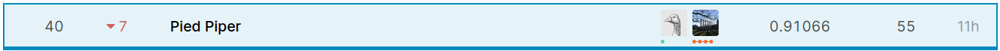

# WiDS Datathon 2020

This is the repository for the Kaggle competition: 

https://www.kaggle.com/c/widsdatathon2020/overview

I got 40th out of 951 teams (top 5%)

Key:

- Feature selection (permutation importance and recursive feature elimination)